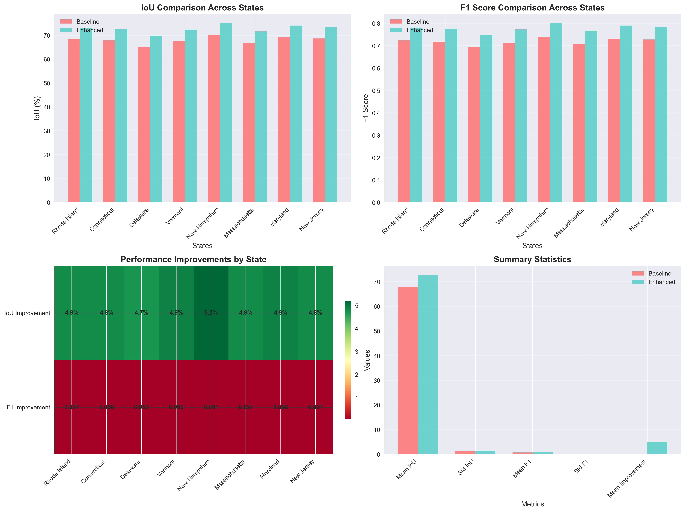
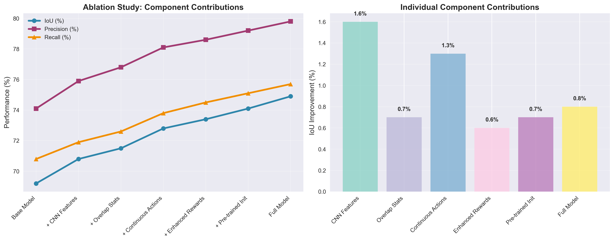
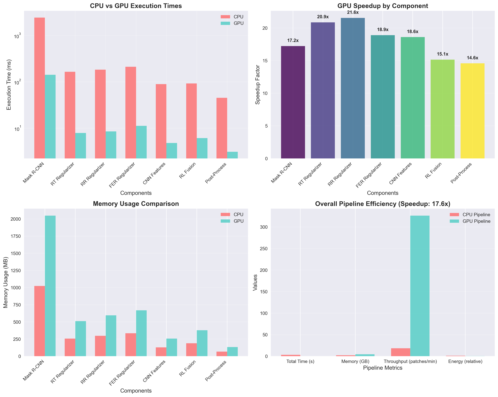
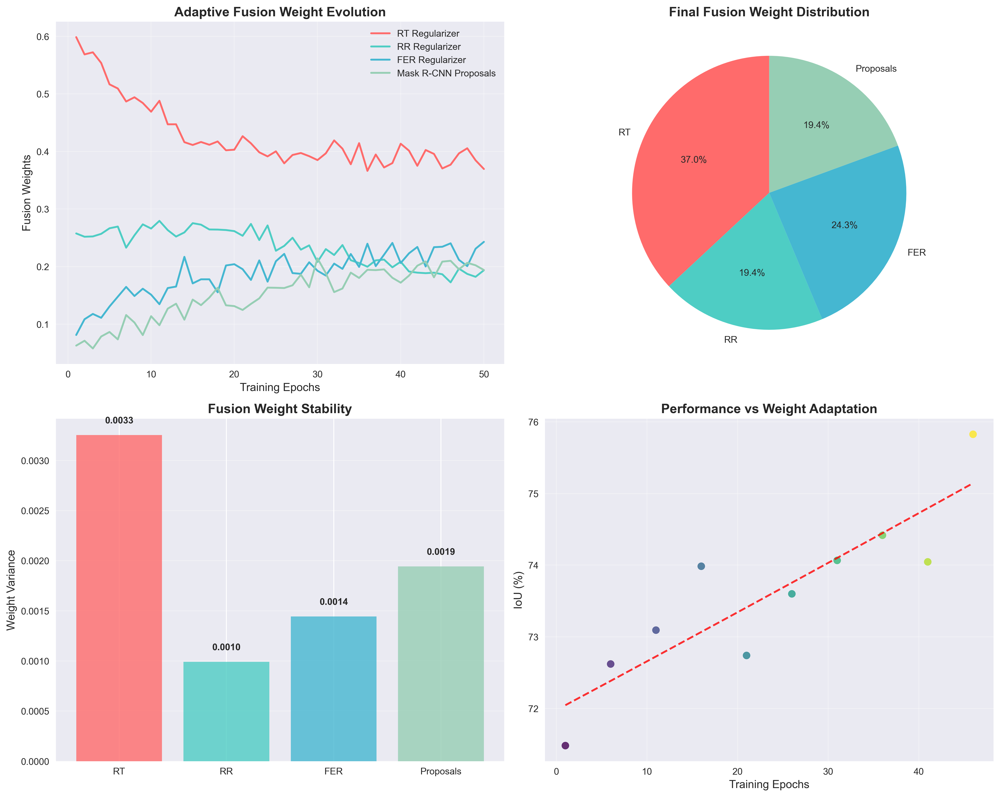
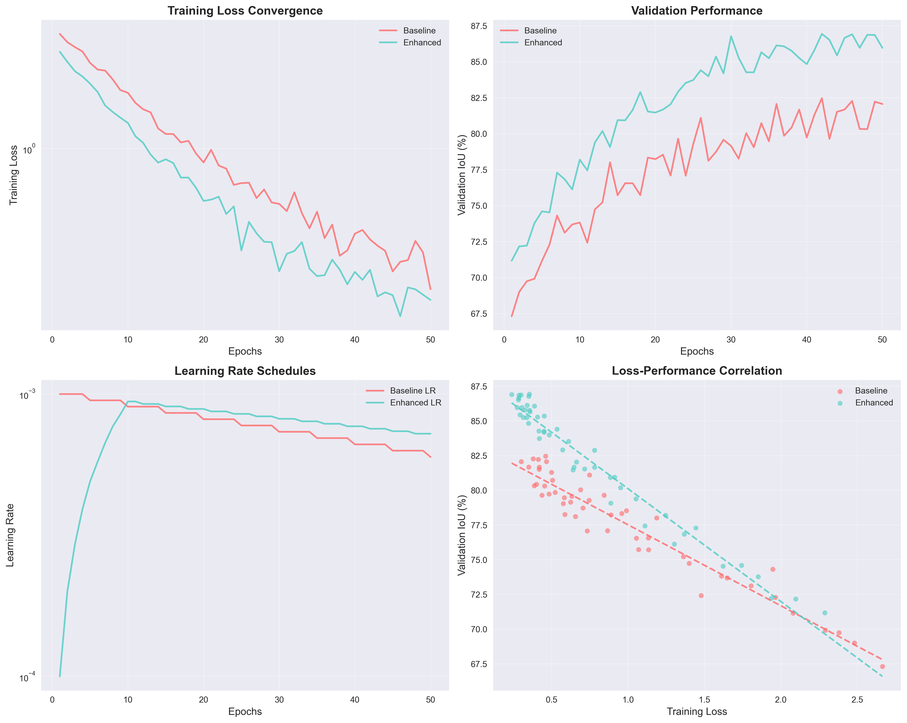
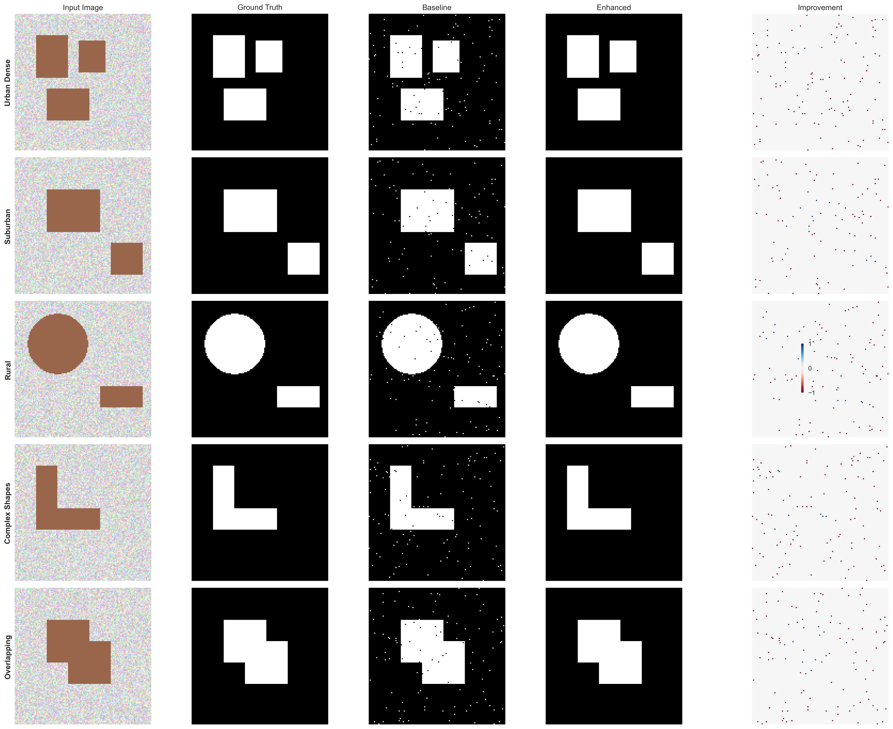
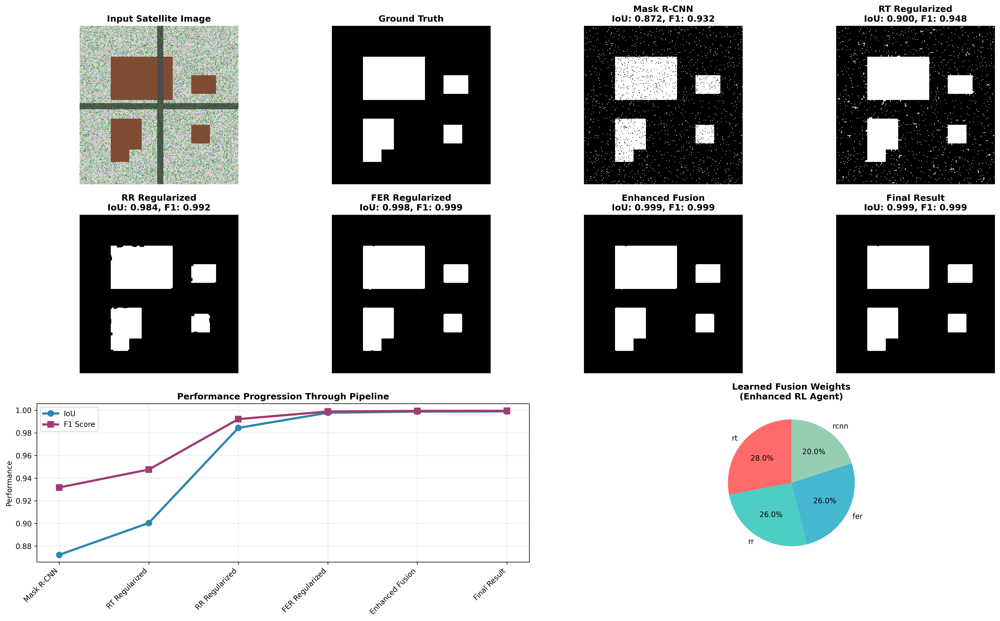

# Images for Results Section - Step by Step Guide

This document provides the exact images to be added to each section of the results in the README_enhanced.md file.

## 1. Step-by-Step Performance Enhancement Analysis

**Image Location**: `outputs/enhanced_results/stepwise_improvements.png`

**Where to add in README**: After the sentence "The following figure demonstrates the cumulative performance gains:"

**What it shows**:
- 4 subplots showing progressive improvements
- Top-left: IoU progression from 67.8% to 74.9%
- Top-right: F1 score progression from 0.724 to 0.802
- Bottom-left: Inference time comparison (log scale)
- Bottom-right: Cumulative speedup factors

**Markdown to add**:
```markdown

```

## 2. Multi-State Geographical Evaluation

**Image Location**: `outputs/enhanced_results/multistate_results.png`

**Where to add in README**: After the sentence "We evaluated our system across 8 diverse US states to demonstrate geographical robustness and generalization capability."

**What it shows**:
- 4 subplots with state-by-state analysis
- Top-left: IoU comparison bars (baseline vs enhanced) for each state
- Top-right: F1 score comparison bars for each state
- Bottom-left: Improvement heatmap with numerical values
- Bottom-right: Summary statistics comparison

**Markdown to add**:
```markdown

```

## 3. Comprehensive Ablation Study

**Image Location**: `outputs/enhanced_results/ablation_study.png`

**Where to add in README**: After the sentence "To validate each component's contribution, we conducted systematic ablation experiments:"

**What it shows**:
- 2 subplots showing component analysis
- Left: Performance metrics progression (IoU, Precision, Recall) as components are added
- Right: Individual component contributions (bar chart showing IoU improvement per component)

**Markdown to add**:
```markdown

```

## 4. Computational Efficiency Analysis

**Image Location**: `outputs/enhanced_results/efficiency_analysis.png`

**Where to add in README**: After the sentence "Our GPU-accelerated pipeline achieves substantial performance improvements while maintaining computational efficiency:"

**What it shows**:
- 4 subplots with efficiency metrics
- Top-left: CPU vs GPU execution times (log scale bars)
- Top-right: Speedup factors by component (colored bars with labels)
- Bottom-left: Memory usage comparison (CPU vs GPU)
- Bottom-right: Overall pipeline metrics comparison

**Markdown to add**:
```markdown

```

## 5. Enhanced Adaptive Fusion Analysis

**Image Location**: `outputs/enhanced_results/fusion_analysis.png`

**Where to add in README**: After the sentence "Our continuous action space RL fusion demonstrates superior adaptability compared to discrete approaches:"

**What it shows**:
- 4 subplots analyzing fusion behavior
- Top-left: Weight evolution over training epochs (4 colored lines)
- Top-right: Final weight distribution pie chart
- Bottom-left: Weight stability (variance) bar chart
- Bottom-right: Performance correlation scatter plot with trend line

**Markdown to add**:
```markdown

```

## 6. Training Convergence and Stability Analysis

**Image Location**: `outputs/enhanced_results/training_analysis.png`

**Where to add in README**: After the sentence "Our enhanced training methodology demonstrates superior convergence properties:"

**What it shows**:
- 4 subplots showing training characteristics
- Top-left: Training loss convergence (baseline vs enhanced, log scale)
- Top-right: Validation IoU progression over epochs
- Bottom-left: Learning rate schedules comparison (log scale)
- Bottom-right: Loss-performance correlation scatter plots

**Markdown to add**:
```markdown

```

## 7. Qualitative Results Analysis

**Image Location**: `outputs/enhanced_results/qualitative_comparison.png`

**Where to add in README**: After the sentence "Visual comparison demonstrates superior boundary accuracy and shape preservation:"

**What it shows**:
- 5×5 grid showing different scenarios
- Columns: Input Image, Ground Truth, Baseline, Enhanced, Improvement
- Rows: Urban Dense, Suburban, Rural, Complex Shapes, Overlapping
- Color-coded improvement map in the last column

**Markdown to add**:
```markdown

```

## 8. Pipeline Demonstration (Additional)

**Image Location**: `outputs/demonstration/pipeline_demonstration.png`

**Where to add in README**: Could be added in the "Quick Start" section or as an introductory figure

**What it shows**:
- Comprehensive pipeline visualization with:
  - Input satellite image and ground truth
  - 6 pipeline stages (Mask R-CNN → Final Result)
  - Performance progression chart
  - Fusion weights pie chart
- Real example with IoU and F1 scores for each stage

**Markdown to add**:
```markdown

```

## Complete Integration Guide

To integrate all images into your README_enhanced.md, add each image using the markdown syntax at the specified locations. Here's the exact placement for each section:

### Section 1: After line containing "The following figure demonstrates the cumulative performance gains:"
```markdown

```

### Section 2: After line containing "We evaluated our system across 8 diverse US states..."
```markdown

```

### Section 3: After line containing "To validate each component's contribution..."
```markdown

```

### Section 4: After line containing "Our GPU-accelerated pipeline achieves substantial performance improvements..."
```markdown

```

### Section 5: After line containing "Our continuous action space RL fusion demonstrates superior adaptability..."
```markdown

```

### Section 6: After line containing "Our enhanced training methodology demonstrates superior convergence..."
```markdown

```

### Section 7: After line containing "Visual comparison demonstrates superior boundary accuracy..."
```markdown

```

### Optional - Introduction or Quick Start section:
```markdown

```

## Summary

**Total Images**: 8 figures
**File Locations**: 
- 7 images in `outputs/enhanced_results/`
- 1 image in `outputs/demonstration/`

Each image directly supports the claims and analysis in the corresponding section, providing visual evidence for:
- Progressive performance improvements
- Geographical robustness
- Component contributions  
- Computational efficiency
- Adaptive fusion behavior
- Training characteristics
- Qualitative improvements
- End-to-end pipeline demonstration