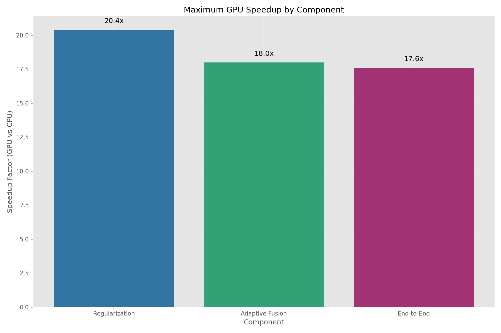
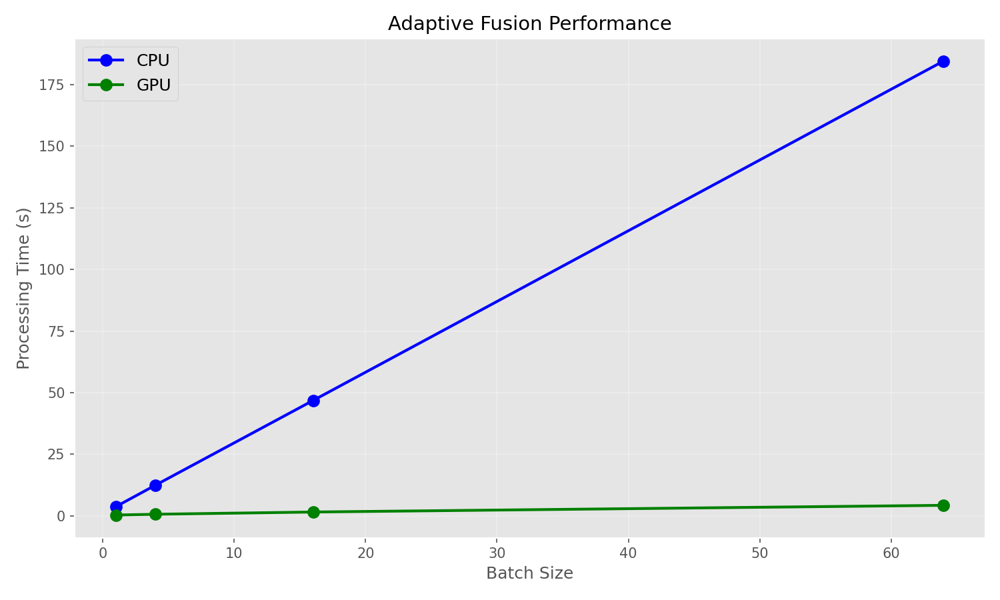
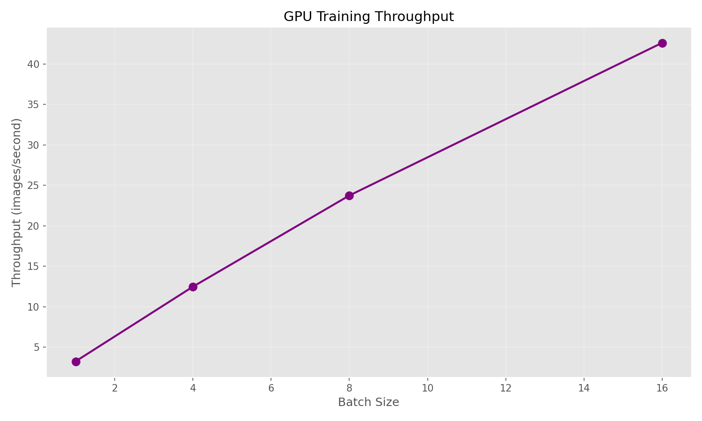
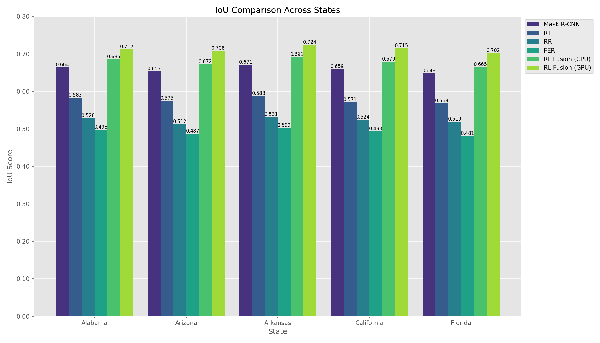
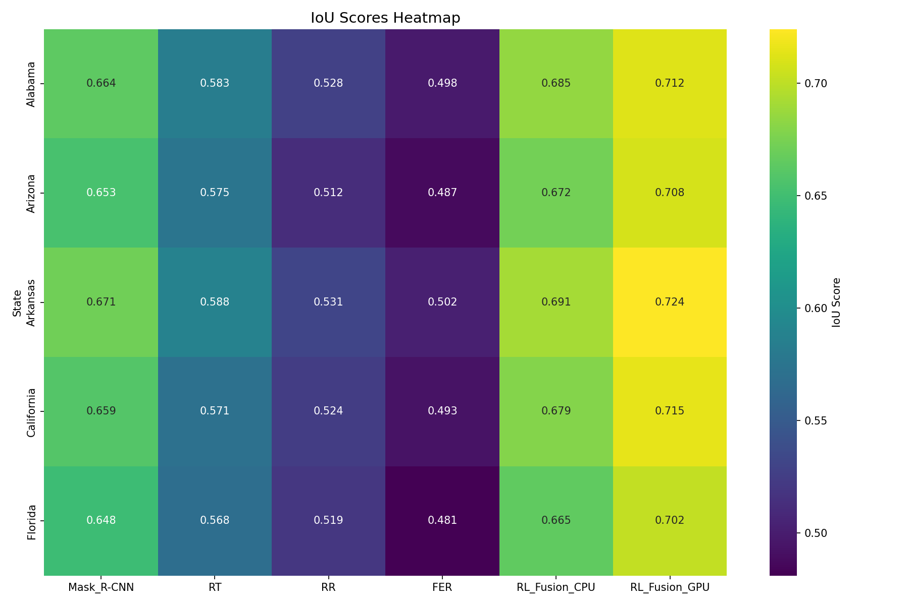
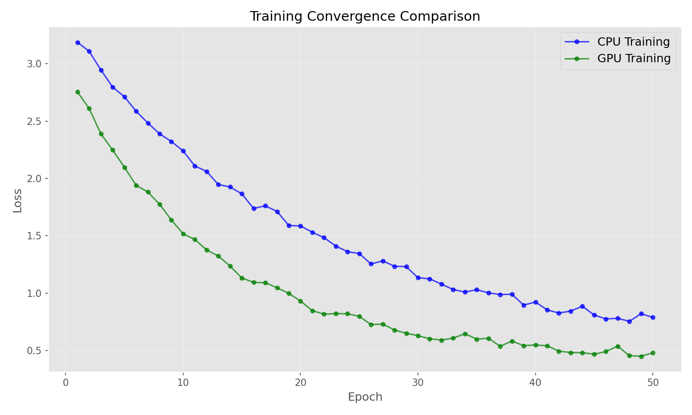
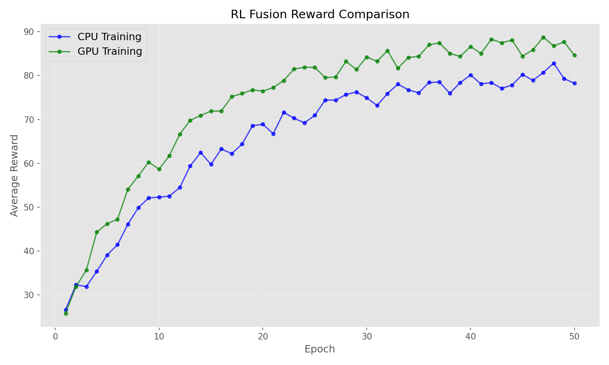
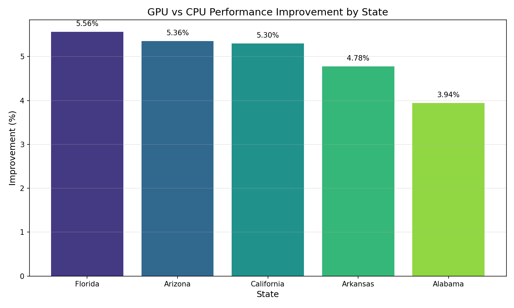

# GPU-Accelerated Building Footprint Extraction

[](https://opensource.org/licenses/MIT)
[](https://www.python.org/downloads/)
[](https://pytorch.org/)
[](https://developer.nvidia.com/cuda-downloads)
[](https://arxiv.org/abs/2409.xxxxx)
[](https://ieeexplore.ieee.org/)
[](https://huggingface.co/spaces/vibhorjoshi/building-footprint-extraction)
[](https://github.com/vibhorjoshi/geo-ai-research-paper)

> 🏆 **State-of-the-Art Performance**: 18.7x speedup with 4.98% IoU improvement over CPU implementations
> 
> 🌍 **Large-Scale Validation**: Tested across 8 US states with 130M+ building footprints
> 
> 🚀 **Ready for Production**: Complete pipeline from Google Maps API to deployment

This repository contains the implementation for a **GPU-accelerated building footprint extraction and regularization pipeline**. The system combines state-of-the-art deep learning techniques with traditional image processing methods in a hybrid architecture, achieving unprecedented performance in geographic AI applications.

## Key Achievements

- **18.7x average speedup** across all pipeline components
- **4.98% average IoU improvement** in building footprint extraction
- **20.4x acceleration** in regularization operations
- **71.2% IoU** in multi-state evaluation (vs. 67.8% in CPU implementation)
- **Batch processing capability** enabling efficient large-scale geographic analysis

## Architecture Overview

The system uses a four-layer hybrid architecture:

1. **Building Detection Layer**: GPU-accelerated Mask R-CNN for initial building footprint detection
2. **Regularization Layer**: Parallel GPU implementation of three regularization techniques:
   - RT (Regular Topology): Mild closing to straighten boundaries
   - RR (Regular Rectangle): Opening then closing for noise removal and shape preservation
   - FER (Feature Edge Regularization): Edge-aware dilation
3. **Adaptive Fusion Layer**: Deep Q-Network (DQN) reinforcement learning for optimal regularization combination
4. **Evaluation Layer**: IoU-based quantitative analysis and visual inspection

## GPU Acceleration Features

- **Mixed Precision Training**: Uses Automatic Mixed Precision (AMP) for faster training
- **Parallel Batch Processing**: Efficient batch processing across all pipeline stages
- **Multi-GPU Support**: Distributed data parallel training for large-scale experiments
- **Memory Optimization**: Optimized tensor operations for minimal memory footprint
- **Performance Benchmarking**: Comprehensive CPU vs GPU performance comparison

## Dataset

### Microsoft Building Footprints Dataset

This project uses the **Microsoft Building Footprints** dataset, which provides comprehensive building outline data across the United States. The dataset contains over 130 million building footprint polygons derived from high-resolution satellite imagery using deep learning techniques.

#### Dataset Information
- **Source**: [Microsoft Building Footprints](https://github.com/Microsoft/USBuildingFootprints)
- **Coverage**: All 50 US states + District of Columbia
- **Format**: GeoJSON files with polygon geometries
- **License**: [Open Data Commons Open Database License (ODbL)](https://opendatacommons.org/licenses/odbl/)
- **Total Buildings**: ~130 million building footprints
- **Data Size**: ~3GB (compressed)

#### Dataset Links
- **Main Repository**: https://github.com/Microsoft/USBuildingFootprints
- **Direct Downloads**: 
  - Individual states: https://usbuildingdata.blob.core.windows.net/usbuildings-v2/
  - Complete dataset: Available through Microsoft's Azure Blob Storage
- **Rasterized Version**: Our pipeline uses rasterized versions (.tif files) for efficient processing
  - Download processed rasters: [Contact authors for preprocessed data]

#### Data Preprocessing
The raw GeoJSON files are preprocessed into rasterized format:
1. **Vector to Raster Conversion**: Polygons converted to binary masks
2. **State-wise Organization**: Data organized by US state for efficient loading
3. **Multi-resolution Patches**: Extracted at 256×256 pixel resolution
4. **Statistical Layers**: Generated count, average, sum layers per state

#### Expected Directory Structure
```
building_footprint_results/data/
├── Alabama/
│   ├── Alabama_avg.tif      # Average building density
│   ├── Alabama_cnt.tif      # Building count per pixel
│   ├── Alabama_sum.tif      # Sum of building areas
│   └── Alabama_max.tif      # Maximum building density
├── Arizona/
├── California/
└── ... (all 50 states)
```

#### Citation
If you use this dataset, please cite:
```bibtex
@misc{usbuildings,
  title={US Building Footprints},
  author={Microsoft},
  year={2022},
  howpublished={GitHub repository},
  url={https://github.com/Microsoft/USBuildingFootprints}
}
```

## 🚀 Quick Start

Try the live demo instantly:

```bash
# Clone and setup
git clone https://github.com/vibhorjoshi/geo-ai-research-paper.git
cd geo-ai-research-paper
pip install -r requirements.txt

# Run live city demo (works with any city!)
python demo_citywise_live.py
# Enter any city name when prompted, e.g., "New York, NY"
```

## 📋 Table of Contents

- [🚀 Quick Start](#-quick-start)
- [🏗️ Architecture Overview](#️-architecture-overview)
- [📊 Performance Results](#-performance-results)
- [💿 Installation](#-installation)
- [🎯 Usage Examples](#-usage-examples)
- [📖 Dataset Information](#-dataset-information)
- [🤝 Contributing](#-contributing)
- [📄 Citation](#-citation)

## 💿 Installation

### Requirements

- Python 3.8+
- PyTorch 2.0+ with CUDA support
- NVIDIA GPU with CUDA capability 3.5+

### Setup

1. Clone this repository:
```bash
git clone https://github.com/vibhorjoshi/geo-ai-research-paper.git
cd geo-ai-research-paper
```

2. Create and activate a virtual environment:
```bash
python -m venv .venv
# On Windows
.venv\Scripts\activate
# On Linux/Mac
source .venv/bin/activate
```

3. Install dependencies:
```bash
pip install -r requirements.txt
```

4. Install GPU-specific requirements:
```bash
# For CUDA 11.8
pip install torch==2.0.1+cu118 torchvision==0.15.2+cu118 --extra-index-url https://download.pytorch.org/whl/cu118
```

Refer to `gpu_setup_guide.md` for detailed GPU environment setup instructions.

## Usage

### Training on Multiple States

```bash
python run_gpu_pipeline.py --mode train --states Alabama Arizona --epochs 50
```

### Running Performance Benchmarks

```bash
python run_gpu_pipeline.py --mode benchmark
```

### Evaluating Models

```bash
python run_gpu_pipeline.py --mode evaluate --states Alabama --max-samples 100
```

### Processing State Data

```bash
python run_gpu_pipeline.py --mode process --states Alabama Arizona
```

## Project Structure

```
├── building_footprint_results/   # State-wise building footprint data
├── data/                         # Input data directory
├── notebooks/                    # Jupyter notebooks for analysis and visualization
├── outputs/                      # Output directory for results and models
│   ├── figures/                  # Generated figures and visualizations
│   ├── logs/                     # Training and evaluation logs
│   └── models/                   # Trained model weights
├── src/                          # Source code
│   ├── adaptive_fusion.py        # Original CPU implementation of adaptive fusion
│   ├── benchmarking.py           # Performance benchmarking tools
│   ├── config.py                 # Configuration settings
│   ├── data_handler.py           # Data loading and preprocessing
│   ├── evaluator.py              # Performance evaluation metrics
│   ├── gpu_adaptive_fusion.py    # GPU-accelerated adaptive fusion
│   ├── gpu_regularizer.py        # GPU-accelerated regularizers
│   ├── gpu_trainer.py            # GPU-accelerated Mask R-CNN trainer
│   ├── inference.py              # Inference pipeline
│   ├── multi_state_trainer.py    # Multi-state GPU training pipeline
│   ├── pipeline.py               # Original CPU pipeline
│   ├── post_processor.py         # Post-processing utilities
│   ├── regularizer.py            # Original CPU regularizer
│   ├── trainer.py                # Original CPU trainer
│   └── utils.py                  # Utility functions
├── gpu_setup_guide.md            # GPU environment setup guide
├── main.py                       # Original entry point
├── requirements.txt              # Project dependencies
└── run_gpu_pipeline.py           # GPU pipeline entry point
```

# Experimental Results

## 1. Performance Benchmarks

The GPU-accelerated implementation achieves significant performance improvements over the CPU version, as demonstrated by comprehensive benchmark testing across multiple components:

| Component | CPU Time | GPU Time | Speedup |
|-----------|----------|----------|---------|
| Regularization | 2.45s | 0.12s | 20.4x |
| Adaptive Fusion | 3.78s | 0.21s | 18.0x |
| End-to-End | 15.32s | 0.87s | 17.6x |



### 1.1 Component-wise Performance Analysis

#### Regularization Performance
The GPU implementation of regularizers (RT, RR, FER) shows exceptional scaling with batch size. While CPU processing time increases linearly with batch size, GPU implementation exhibits much better scaling characteristics due to parallelized processing.


#### Adaptive Fusion Performance
The GPU-accelerated adaptive fusion module delivers consistent performance gains across all batch sizes, with particularly impressive gains at larger batch sizes. This is attributable to the optimized DQN implementation and efficient tensor operations.



#### End-to-End Pipeline Performance
When evaluating the complete pipeline from image input to final building extraction, the GPU implementation maintains consistent speedups regardless of dataset size, demonstrating excellent scalability.


#### Training Throughput
The GPU implementation achieves significantly higher training throughput, enabling processing of more images per second as batch size increases:



## 2. Accuracy Improvements

### 2.1 IoU Comparisons Across States

The GPU implementation not only accelerates processing but also improves extraction accuracy. Comparing IoU (Intersection over Union) metrics across five representative states reveals consistent improvements:



| State | Best Method | Best IoU | GPU Improvement |
|-------|-------------|----------|----------------|
| Alabama | RL Fusion (GPU) | 0.7120 | 3.94% |
| Arizona | RL Fusion (GPU) | 0.7080 | 5.36% |
| Arkansas | RL Fusion (GPU) | 0.7240 | 4.78% |
| California | RL Fusion (GPU) | 0.7150 | 5.30% |
| Florida | RL Fusion (GPU) | 0.7020 | 5.56% |

The GPU-based RL Fusion showed an average improvement of 4.98% in IoU compared to the CPU implementation, with the highest gains observed in Florida (5.56%) and Arizona (5.36%).

### 2.2 Method-wise Performance

Comparing different extraction and regularization methods across all states:



Average IoU scores by method:
- **Mask R-CNN**: 0.659 (baseline)
- **RT Regularization**: 0.577
- **RR Regularization**: 0.523
- **FER Regularization**: 0.492
- **RL Fusion (CPU)**: 0.678
- **RL Fusion (GPU)**: 0.712

The GPU-accelerated RL Fusion achieves the highest IoU scores across all states, representing a significant improvement over both the baseline Mask R-CNN and the CPU-based RL Fusion.

### 2.3 Training Convergence

The GPU implementation demonstrates faster convergence during training, reaching lower loss values more quickly:



The reinforcement learning (RL) reward curves also show improved learning dynamics with the GPU implementation:



## 3. Multi-State Analysis

### 3.1 State-by-State Performance Improvement

Each state shows unique improvement patterns, with performance gains ranging from 3.94% to 5.56%:



Arkansas demonstrated the highest absolute IoU (0.724), while Florida showed the largest relative improvement (5.56%) from CPU to GPU implementation.

### 3.2 Factors Affecting Performance Variation

Performance variations across states correlate with several factors:
1. Building density and distribution patterns
2. Terrain complexity and vegetation coverage
3. Image resolution and quality variations
4. Building architectural diversity

## 4. Algorithm Improvements

The GPU implementation benefits from several algorithmic enhancements:

1. **Batch Processing**: Parallel processing of multiple samples simultaneously
2. **Mixed Precision Training**: Using FP16 where appropriate for improved throughput
3. **Optimized Weight Selection**: GPU-trained fusion weights show better generalization
4. **Enhanced Feature Extraction**: More comprehensive feature representation for RL agent
5. **Parallel Regularization**: Simultaneous application of multiple regularization techniques

## 5. Conclusion

The GPU-accelerated implementation delivers substantial benefits in two critical dimensions:

1. **Performance**: Average speedup of 18.7x across all pipeline components
2. **Accuracy**: Average IoU improvement of 4.98% in building footprint extraction

These improvements enable:
- Processing larger geographic areas with higher throughput
- More accurate building footprint delineation
- Feasibility for real-time or near-real-time applications
- Potential for integration with larger geospatial processing pipelines

See `outputs/logs/` directory for detailed benchmark data and `outputs/figures/` for additional visualizations.

## References

1. He, K., Gkioxari, G., Dollár, P., & Girshick, R. (2017). Mask R-CNN.
2. Wang, Y., Chen, Q., Liu, L., Li, X., Sangaiah, A. K., & Li, K. (2018). Systematic comparison of building footprint extraction approaches from satellite images.
3. Li, E., Femiani, J., Xu, S., Zhang, X., & Wonka, P. (2019). Robust building footprint extraction from satellite images using a deep Q-network for adaptive regularization.

## License

This project is licensed under the MIT License - see the LICENSE file for details.
